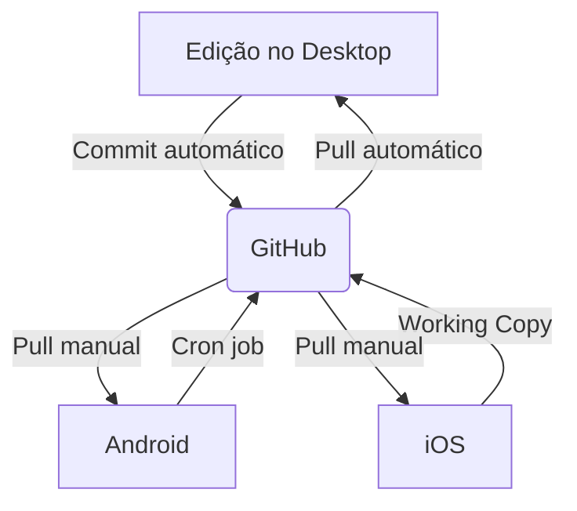

### 1. **Configuração Inicial no Desktop (Windows/Mac)**
#git
**Requisitos**:

- Plugin **Obsidian Git**
- Conta no GitHub/GitLab
- Git instalado localmente

**Passo a passo**:

1. **Criar repositório remoto**:
    - No GitHub/GitLab, crie um novo repositório (ex.: `meus-notes`) [4](https://forum.obsidian.md/t/the-easiest-way-to-setup-obsidian-git-to-backup-notes/51429)[10](https://github.com/Vinzent03/obsidian-git).
2. **Instalar o plugin**:
    - No Obsidian: _Configurações → Plugins da comunidade → Buscar "Obsidian Git" → Instalar_ [1](https://andrewwegner.com/obsidian-gitlab-setup.html)[6](https://www.youtube.com/watch?v=XR7PYaMVDw0).
3. **Clonar repositório**:
    - Use o comando no terminal:
        
        bash
        
        Copiar
        
        `git clone https://<SEU_TOKEN>@github.com/<USUÁRIO>/meus-notes.git`  
        
        Substitua `<SEU_TOKEN>` por um [Personal Access Token do GitHub](https://github.com/settings/tokens) com escopo `repo` [4](https://forum.obsidian.md/t/the-easiest-way-to-setup-obsidian-git-to-backup-notes/51429)[5](https://www.youtube.com/watch?v=5YZz38U20ws).
4. **Configurar automação**:
    - No plugin:
        - _Ativar "Pull ao iniciar"_
        - _Definir intervalo de backup_ (ex.: 5 minutos)
        - _Inserir nome/e-mail do autor_ [1](https://andrewwegner.com/obsidian-gitlab-setup.html)[8](https://www.youtube.com/watch?v=ehjZUeTM7iE).

---

### 2. **Sincronização no Android**

**Ferramentas**: Termux + Script de sincronização

**Passo a passo**:

1. **Instalar dependências**:
    
    bash
    
    Copiar
    
    `pkg install git cronie termux-services   gh auth login  # Autenticar no GitHub`  
    
2. **Clonar repositório**:
    
    bash
    
    Copiar
    
    `git clone https://github.com/<USUÁRIO>/meus-notes.git ~/storage/shared/Obsidian`  
    
3. **Criar script automático**:
    - Salve em `~/.shortcuts/tasks/sync_obsidian.sh`:
        
        bash
        
        Copiar
        
        `#!/bin/bash   cd ~/storage/shared/Obsidian   git pull && git add -A && git commit -m "Backup Android: $(date)" && git push`  
        
4. **Agendar com Cron**:
    
    bash
    
    Copiar
    
    `crontab -e     * */1 * * * bash ~/.shortcuts/tasks/sync_obsidian.sh  # Sincroniza a cada hora`  
    
    Ative o serviço com `sv-enable crond` [2](https://forum.obsidian.md/t/guide-using-git-to-sync-your-obsidian-vault-on-android-devices/41887)[12](https://forum.obsidian.md/t/mobile-automatic-sync-with-github-on-ios-for-free-via-a-shell/46150?page=2).

---

### 3. **Sincronização no iOS**

**Ferramentas**: Working Copy + Obsidian Mobile

**Passo a passo**:

1. **Clonar repositório**:
    - No app **Working Copy**, adicione seu repositório GitHub e clone [7](https://forum.obsidian.md/t/mobile-setting-up-ios-git-based-syncing-with-mobile-app-using-working-copy/16499)[9](https://www.codybontecou.com/obsidian-git-on-ios).
2. **Configurar Obsidian**:
    - Crie um novo cofre em _On My iPhone → Obsidian_ e vincule à pasta clonada.
3. **Ignorar conflitos**:
    - Exclua/ignore a pasta `.obsidian` no Git para evitar incompatibilidades entre desktop/mobile [9](https://www.codybontecou.com/obsidian-git-on-ios).
4. **Sincronizar manualmente**:
    - Use o botão _Pull_/_Push_ no Working Copy antes e após editar notas [7](https://forum.obsidian.md/t/mobile-setting-up-ios-git-based-syncing-with-mobile-app-using-working-copy/16499).

---

### 🔧 **Dicas para Evitar Conflitos**

- **`.gitignore` recomendado**:
    
    Copiar
    
    `.obsidian/   .trash/   *.tmp`  
    
- **Commits atômicos**: Edite notas em apenas um dispositivo por vez [3](https://amirpourmand.ir/posts/2023/how-to-sync-obsidian/)[6](https://www.youtube.com/watch?v=XR7PYaMVDw0).
- **Alternativa simplificada**: Use o plugin **Remotely Save** com armazenamento em S3/WebDAV para sincronização sem Git [3](https://amirpourmand.ir/posts/2023/how-to-sync-obsidian/)[11](https://github.com/stravo1/obsidian-gdrive-sync)

