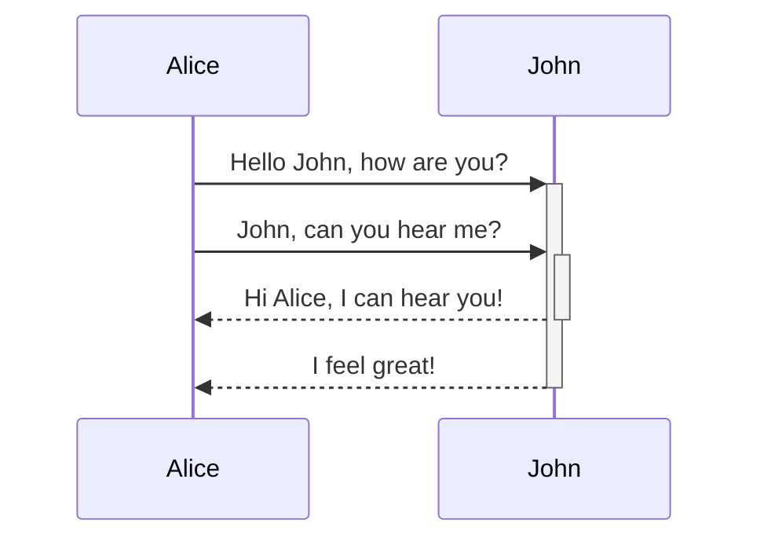
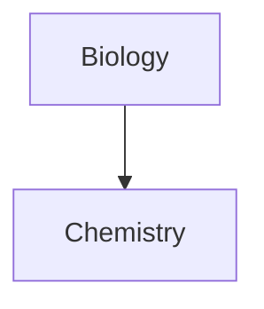

## [[1. Introdução]]
Zettelkasten e Obsidian para investigação de fontes abertas

Professor: Franqlin Soares dos Santos 
---
## [[2. As Origens do Método Zettelkasten]]

---

---
![[CURSO-ZETTELKASTEN/INBOX/Images/image.png]]

---
![[CURSO-ZETTELKASTEN/INBOX/Images/image 1.png]]
---
[[6. Tipos de Notas| 3.1 Tipo de Notas]]
![[Pasted image 20250304233717.png]]

---
[[CURSO-ZETTELKASTEN/NOTAS-PERMANENTES/Apresentação/Estrutura Básica de Pastas para Zettelkasten no Obsidian|3.1 Estrutura Básica de Pastas para Zettelkasten no Obsidian]]
![[Pasted image 20250304234003.png]]
---
## [[Capturando Conhecimento]]
![[Pasted image 20250304233425.png]]
---
FLUXO DE CRIAÇÃO DE NOTAS

![[Pasted image 20250304234813.png]]

---
## Configurando o Obsidian

![[Pasted image 20250304235555.png]]
---
## Introdução à Escrita em Markdown
---
## FORMATAÇÃO BÁSICA 
![[Pasted image 20250305000104.png]]
https://help.obsidian.md/syntax
---

## NÍVEIS DE TÍTULOS
![[Pasted image 20250305000450.png]]
---
![[Pasted image 20250305000650.png]]
---
![[Pasted image 20250305000721.png]]
---
![[Pasted image 20250305000831.png]]
---
![[Pasted image 20250305001247.png]]
---
![[Pasted image 20250305001315.png]]
---
EDIÇÃO AVANÇADA

---
Tabelas

![[Pasted image 20250305003407.png]]

---
DIAGRAMAS

![[Pasted image 20250305003514.png]]

---
## Plugins e  Interação Visual com Notas
![[Pasted image 20250305014356.png]]
---

---
## Criando o Backlog de Consumo
---
## Tags vs Pastas
---
## Tags vs Links
---
## Organização e Estrutura do Vault
---
## Esteja Atento ao Desperdício de Tempo

