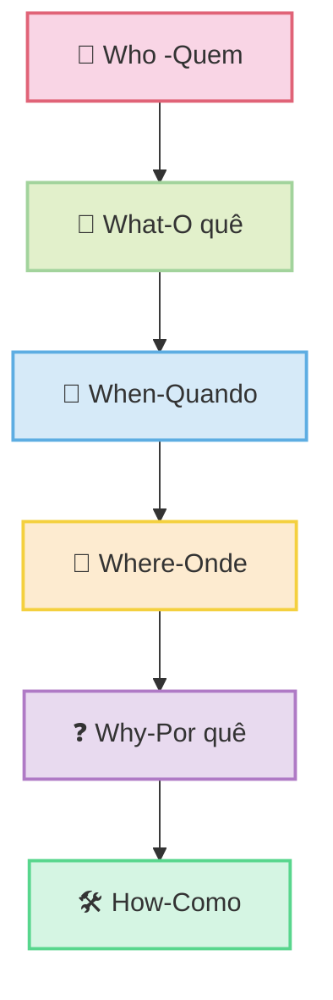

### 1. **Who (Quem)**

- **Objetivo**: Identificar os indivíduos, grupos ou entidades envolvidos.
- **Aplicação no OSINT**:
    - Quem é o alvo da investigação?
    - Quem são os associados, colaboradores ou adversários?
    - Quem pode ser uma fonte de informação confiável?
- **Exemplo**: Investigar perfis em redes sociais, listas de diretores de empresas ou registros públicos.

---

### 2. **What (O quê)**

- **Objetivo**: Definir o que está sendo investigado ou o que ocorreu.
- **Aplicação no OSINT**:
    - O que está em questão? (um evento, um crime, uma atividade suspeita)
    - O que foi publicado ou compartilhado publicamente?
    - O que precisa ser verificado ou confirmado?
- **Exemplo**: Analisar documentos, postagens, notícias ou transações financeiras.

---

### 3. **When (Quando)**

- **Objetivo**: Estabelecer o momento ou período em que algo ocorreu.
- **Aplicação no OSINT**:
    - Quando o evento ou atividade aconteceu?
    - Quando a informação foi publicada ou atualizada?
    - Quando é relevante para a investigação?
- **Exemplo**: Verificar datas de postagens, registros de transações ou logs de atividade.

---

### 4. **Where (Onde)**

- **Objetivo**: Localizar o local ou contexto geográfico do evento.
- **Aplicação no OSINT**:
    - Onde o evento ocorreu?
    - Onde a informação foi publicada ou compartilhada?
    - Onde o alvo está localizado ou atua?
- **Exemplo**: Usar ferramentas de geolocalização, mapas ou registros de endereços IP.

---

### 5. **Why (Por quê)**

- **Objetivo**: Compreender as motivações ou causas por trás do evento.
- **Aplicação no OSINT**:
    - Por que o evento ocorreu?
    - Por que o alvo está agindo de determinada maneira?
    - Por que a informação foi publicada?
- **Exemplo**: Analisar discursos, motivações políticas ou interesses econômicos.

---

### 6. **How (Como)**

- **Objetivo**: Entender o processo ou método utilizado.
- **Aplicação no OSINT**:
    - Como o evento foi executado?
    - Como a informação foi obtida ou disseminada?
    - Como o alvo opera ou se comunica?
- **Exemplo**: Investigar técnicas de comunicação, ferramentas utilizadas ou padrões de comportamento.