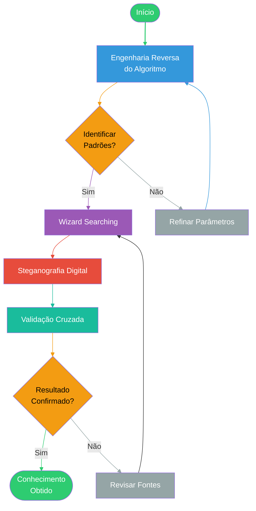

### 1. **Engenharia Reversa de Motores de Busca**

Fravia analisava o código e o comportamento de algoritmos como o Google para identificar padrões de indexação e ranqueamento. Isso permitia:

- **Exploração de lacunas técnicas** para acessar conteúdos ocultos ou não indexados[11](https://en.wikipedia.org/wiki/Fravia).
- **Manipulação de parâmetros de busca** (ex.: operadores avançados, filtros de tempo, domínio)[11](https://en.wikipedia.org/wiki/Fravia)[14](https://www.cead.ufjf.br/wp-content/uploads/2015/05/media_biblioteca_pesquisa_web.pdf).
- **Decifração de "black boxes"** (algoritmos proprietários) para entender como os resultados são priorizados[11](https://en.wikipedia.org/wiki/Fravia)[13](https://www.youtube.com/watch?v=zkEW2MyN5YY).

---

### 2. **Técnicas de "Wizard Searching"**

Foco na busca de conhecimento profundo, não apenas em respostas superficiais:

- **Uso de operadores booleanos não documentados**:  
    Ex.: `allintext:`, `related:`, `filetype:pdf` para filtrar resultados específicos[7](https://literacia-da-informacao1.webnode.pt/pesquisadainformacao/)[14](https://www.cead.ufjf.br/wp-content/uploads/2015/05/media_biblioteca_pesquisa_web.pdf).
- **Busca por "pegadas digitais"**:  
    Identificação de padrões em URLs, metadados e estruturas de sites para rastrear informações[11](https://en.wikipedia.org/wiki/Fravia).
- **Análise de logs de acesso**:  
    Estudo de cookies, headers HTTP e dados de sessão para mapear comportamentos de indexação[11](https://en.wikipedia.org/wiki/Fravia).

---

### 3. **Steganografia Digital**

Fravia aplicava técnicas de ocultação de dados para:

- **Localizar informações camufladas** em imagens, arquivos PDF ou páginas HTML[11](https://en.wikipedia.org/wiki/Fravia).
- **Explorar "web invisível"**:  
    Acesso a bancos de dados acadêmicos, fóruns restritos e repositórios não indexados por motores convencionais[11](https://en.wikipedia.org/wiki/Fravia)[13](https://www.youtube.com/watch?v=zkEW2MyN5YY).

---

### 4. **Abordagem Crítica**

- **Desconfiança de resultados comerciais**:  
    Rejeição à superficialidade dos algoritmos de busca dominantes (ex.: Google), considerados enviesados por interesses econômicos[11](https://en.wikipedia.org/wiki/Fravia).
- **Validação cruzada de fontes**:  
    Comparação de resultados entre múltiplos motores (DuckDuckGo, Startpage) e técnicas manuais[7](https://literacia-da-informacao1.webnode.pt/pesquisadainformacao/)[14](https://www.cead.ufjf.br/wp-content/uploads/2015/05/media_biblioteca_pesquisa_web.pdf).

---

### 5. **Ferramentas e Recursos**

Fravia mantinha em seus sites (**searchlores.org**, **fravia.com**) tutoriais como:

- **Lessons of the Old Red Cracker**:  
    Guias práticos para análise de código assembly e debugging de algoritmos[11](https://en.wikipedia.org/wiki/Fravia).
- **Websites mirrors**:  
    Arquivos preservados em domínios como _fravia.net_ com tutoriais sobre steganografia e análise de _proxies_[11](https://en.wikipedia.org/wiki/Fravia).

---

### 6. **Aplicações Práticas**

- **Pesquisa acadêmica**:  
    Localização de artigos científicos não indexados em plataformas comerciais[13](https://www.youtube.com/watch?v=zkEW2MyN5YY)[14](https://www.cead.ufjf.br/wp-content/uploads/2015/05/media_biblioteca_pesquisa_web.pdf).
- **Investigação forense digital**:  
    Rastreamento de dados apagados ou fragmentados[11](https://en.wikipedia.org/wiki/Fravia).
- **Contra-inteligência**:  
    Técnicas para proteger informações pessoais de rastreamento automatizado[11](https://en.wikipedia.org/wiki/Fravia).

---

### Comparativo: Fravia vs. Métodos Convencionais

|**Aspecto**|**Metodologia Fravia**|**Busca Convencional**|
|---|---|---|
|**Foco**|Engenharia reversa e conhecimento oculto|Resultados superficiais|
|**Ferramentas**|Operadores avançados, steganografia|Palavras-chave simples|
|**Objetivo**|Desvendar mecanismos de busca|Obter respostas rápidas|

Essa metodologia permanece relevante para pesquisas especializadas, embora exija atualização constante devido à evolução dos algoritmos[11](https://en.wikipedia.org/wiki/Fravia)[13](https://www.youtube.com/watch?v=zkEW2MyN5YY).