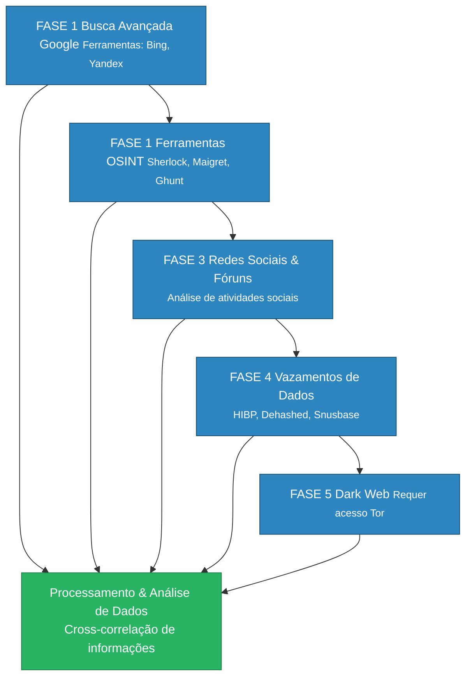

```mermaid
graph TD
  classDef stage fill:#2E86C1,stroke:#1B4F72,color:white
  classDef analysis fill:#28B463,stroke:#1D8348,color:white

  A[FASE 1 Busca Avançada Google <small>Ferramentas: Bing, Yandex</small>] --> B[FASE 1 Ferramentas OSINT <small>Sherlock, Maigret, Ghunt</small>]
  B --> C[FASE 3 Redes Sociais & Fóruns\n<small>Análise de atividades sociais</small>]
  C --> D[FASE 4 Vazamentos de Dados\n<small>HIBP, Dehashed, Snusbase</small>]
  D --> E[FASE 5 Dark Web <small>Requer acesso Tor</small>]
  
  note[Processamento & Análise de Dados\nCross-correlação de informações]:::analysis
  A & B & C & D & E --> note

  class A,B,C,D,E stage
  class note analysis
```
