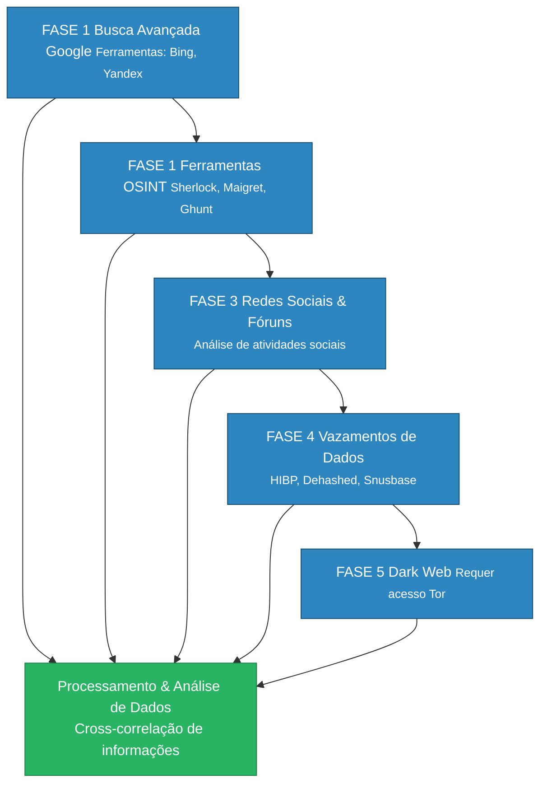

### **1. Busca avançada recursiva em motores de busca**

**Ferramentas**: Google (operadores `site:`, `intitle:`, `inurl:`), Bing, DuckDuckGo, Yandex.  
**Técnicas**:

- Uso de operadores avançados para filtrar resultados específicos em plataformas como Facebook ou Instagram[1](https://www.osint.industries/post/social-media-lookup-how-to-find-hidden-profiles-and-accounts-with-osint)[3](https://backlinko.com/search-engines).
- Combinação de dados como _username_, e-mail ou número de telefone com operadores como `intext:` para identificar interações públicas[10](https://www.youtube.com/watch?v=HORzekIiZZ0).  
    **Exemplo**:

python

Copiar

`site:instagram.com intext:"username_alvo"`

---

### **2. Ferramentas especializadas em OSINT**

**Ferramentas-chave**:

- **OSINT Industries**: Agrega dados de 500+ fontes, incluindo redes sociais internacionais, geolocalização e vazamentos de dados[1](https://www.osint.industries/post/social-media-lookup-how-to-find-hidden-profiles-and-accounts-with-osint)[4](https://liferaftlabs.com/blog/7-best-osint-tools-for-social-media).
- **Maltego**: Mapeia conexões entre e-mails, números e perfis sociais[1](https://www.osint.industries/post/social-media-lookup-how-to-find-hidden-profiles-and-accounts-with-osint).
- **Sherlock/Maigret**: Busca _usernames_ em múltiplas plataformas simultaneamente[13](https://www.youtube.com/watch?v=A_unNjE8R38).
- **SEON**: Análise de risco cruzando dados sociais com impressão digital digital (_fingerprinting_)[2](https://seon.io/resources/dictionary/social-media-profiling/)[5](https://eftsure.com/blog/finance-glossary/what-is-social-media-profiling/).

**Vantagens**:

- Identificação de perfis em plataformas obscuras (ex: Duolingo, Strava)[1](https://www.osint.industries/post/social-media-lookup-how-to-find-hidden-profiles-and-accounts-with-osint).
- Detecção de contas falsas através de inconsistências em dados[2](https://seon.io/resources/dictionary/social-media-profiling/)[5](https://eftsure.com/blog/finance-glossary/what-is-social-media-profiling/).

---

### **3. Análise de atividades em redes sociais e fóruns**

**Ferramentas**:

- **Snap Map**: Geolocalização de posts no Snapchat[4](https://liferaftlabs.com/blog/7-best-osint-tools-for-social-media)[7](https://blog.pagefreezer.com/7-osint-socmint-tools-social-media-investigations).
- **Social Mention**: Monitoramento em tempo real de menções em 100+ plataformas[7](https://blog.pagefreezer.com/7-osint-socmint-tools-social-media-investigations)[11](https://www.sprinklr.com/blog/social-media-analytics-best-practices/).
- **FaceCheck.ID**: Reconhecimento facial em redes usando foto de perfil[10](https://www.youtube.com/watch?v=HORzekIiZZ0).

**Estratégias**:

- Identificação de _hashtags_ associadas ao alvo via Hashatit[4](https://liferaftlabs.com/blog/7-best-osint-tools-for-social-media)[7](https://blog.pagefreezer.com/7-osint-socmint-tools-social-media-investigations).
- Análise de conexões em fóruns como Reddit ou 4chan usando ferramentas como Boardreader[4](https://liferaftlabs.com/blog/7-best-osint-tools-for-social-media)[7](https://blog.pagefreezer.com/7-osint-socmint-tools-social-media-investigations).

---

### **4. Investigação em vazamentos de dados**

**Ferramentas**:

- **HIBP (Have I Been Pwned)**: Verifica se e-mails ou números aparecem em vazamentos[4](https://liferaftlabs.com/blog/7-best-osint-tools-for-social-media).
- **Dehashed/LeakCheck**: Recupera credenciais expostas[4](https://liferaftlabs.com/blog/7-best-osint-tools-for-social-media).

**Casos de uso**:

- Descobrir serviços online secundários usados pelo alvo (ex: contas em fóruns de nicho)[4](https://liferaftlabs.com/blog/7-best-osint-tools-for-social-media)[5](https://eftsure.com/blog/finance-glossary/what-is-social-media-profiling/).
- Validar autenticidade de identidades através de dados históricos[5](https://eftsure.com/blog/finance-glossary/what-is-social-media-profiling/).

---

### **5. Exploração na Dark Web (opcional)**

**Requisitos**:

- Acesso via Tor ou I2P.
- Ferramentas como **OSINT Industries Navigator** ou **DarkSearch.io** para varreduras[1](https://www.osint.industries/post/social-media-lookup-how-to-find-hidden-profiles-and-accounts-with-osint)[4](https://liferaftlabs.com/blog/7-best-osint-tools-for-social-media).

**Precauções**:

- Foco em _marketplaces_ e fóruns específicos relacionados a atividades ilegais[4](https://liferaftlabs.com/blog/7-best-osint-tools-for-social-media).
- Análise de criptomoedas associadas a transações suspeitas[4](https://liferaftlabs.com/blog/7-best-osint-tools-for-social-media).

---

### **Processamento e análise de dados**

**Ferramentas recomendadas**:

- **LifeRaft Navigator**: Consolida dados de redes sociais, fóruns e Dark Web em dashboards interativos[4](https://liferaftlabs.com/blog/7-best-osint-tools-for-social-media).
- **Sprinklr/Socialinsider**: Análise de engajamento e _sentiment analysis_[8](https://www.socialinsider.io/blog/social-media-analysis/)[11](https://www.sprinklr.com/blog/social-media-analytics-best-practices/)[14](https://supermetrics.com/blog/social-media-analytics).

**Métricas críticas**:

- Padrões de atividade (horários, dispositivos usados).
- Relações entre contas e conexões sociais.
- Geolocalização consistente em múltiplas plataformas[1](https://www.osint.industries/post/social-media-lookup-how-to-find-hidden-profiles-and-accounts-with-osint)[10](https://www.youtube.com/watch?v=HORzekIiZZ0).